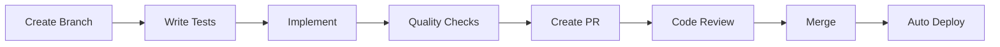

# Claude Development Guidelines for Emoji Smith

## Table of Contents
- [🚀 Quick Start](#quick-start)
- [⚡ Essential Rules](#essential-rules)
- [🏗️ Architecture](#architecture)
- [🧪 Testing](#testing)
- [🔒 Security](#security)
- [🚨 Performance](#performance)
- [📦 Deployment](#deployment)
- [🔧 Development Workflow](#development-workflow)
- [📚 Detailed Examples](#detailed-examples)

## 🚀 Quick Start

### Environment Setup (2 minutes)

⚠️ **CRITICAL: Always activate the virtual environment before ANY command:**

```bash
# 1. Clone and enter the repository
git clone https://github.com/willtech3/emoji-smith.git
cd emoji-smith

# 2. Create and activate virtual environment
uv venv
source .venv/bin/activate  # Linux/Mac
# or
.venv\Scripts\activate     # Windows

# 3. Install all dependencies
uv sync --all-extras

# 4. Install pre-commit hooks
pre-commit install

# 5. Verify setup
python --version  # Should show Python 3.12.x
pytest --version  # Should work without errors
```

**After pulling changes or switching branches:**
```bash
source .venv/bin/activate  # ALWAYS FIRST!
uv sync --all-extras      # Ensures all dependencies including type stubs
```

### Your First Change

1. **Create feature branch**
   ```bash
   git checkout -b feature/your-feature-name
   ```

2. **Write failing test**
   ```bash
   # Create test file: tests/unit/test_your_feature.py
   pytest tests/unit/test_your_feature.py  # Should fail
   ```

3. **Implement feature**
   ```bash
   # Create/edit source files in src/
   ```

4. **Run quality checks**
   ```bash
   ./scripts/check-quality.sh  # Or run individually:
   black src/ tests/
   flake8 src/ tests/
   mypy src/
   bandit -r src/
   pytest --cov=src tests/
   ```

5. **Create PR**
   ```bash
   git add src/specific/files.py tests/specific/test_files.py
   git commit -m "feat: your descriptive message"
   git push origin feature/your-feature-name
   gh pr create
   ```

## ⚡ Essential Rules

### The Five Commandments

1. **🔐 NEVER commit secrets** - No API keys, tokens, or `.env` files
2. **📁 NEVER use `git add .`** - Always specify files explicitly
3. **🐍 ALWAYS use Python 3.12** - Check with `python --version`
4. **🧪 ALWAYS write tests first** - TDD is mandatory
5. **💉 ALWAYS use dependency injection** - No hardcoded dependencies

### Environment Management

| Command | When to Use |
|---------|-------------|
| `source .venv/bin/activate` | Before ANY Python command |
| `uv sync --all-extras` | After pull, branch switch, or dependency changes |
| `pre-commit install` | Once after cloning repo |
| `pre-commit run --all-files` | Before committing to check all files |

## 🏗️ Architecture

### Domain-Driven Design (DDD) Principles

We follow clean architecture with these layers:

```
src/
├── domain/           # Business logic (no external dependencies)
│   ├── entities/     # Core business objects
│   ├── value_objects/# Immutable domain concepts
│   ├── services/     # Domain business logic
│   └── repositories/ # Abstract interfaces (protocols)
├── application/      # Use case orchestration
│   ├── services/     # Application workflows
│   └── handlers/     # Request handlers
├── infrastructure/   # External integrations
│   ├── aws/         # AWS services (Lambda, S3, etc.)
│   ├── slack/       # Slack API implementation
│   └── openai/      # AI service implementation
└── presentation/     # User interfaces
    └── web/         # HTTP/API layer
```

### Key Architecture Rules

1. **Dependency Direction**: Infrastructure → Application → Domain (never reverse)
2. **Repository Pattern**: All external services accessed through abstract interfaces
3. **No Framework Coupling**: Domain layer has zero framework dependencies
4. **Immutable Value Objects**: Use frozen dataclasses for domain concepts

### Known Architecture Constraints

#### Lambda Handler Location
- Webhook handler MUST remain at `src/emojismith/infrastructure/aws/webhook_handler.py`
- Worker handler MUST remain at `src/emojismith/infrastructure/aws/worker_handler.py`
- These locations are hardcoded in CDK deployment configuration

#### Environment Variables
```python
# ❌ WRONG - Direct access in domain/application
api_key = os.environ["OPENAI_API_KEY"]

# ✅ CORRECT - Through configuration object
class Config:
    openai_api_key: str

    @classmethod
    def from_env(cls) -> "Config":
        return cls(openai_api_key=os.environ["OPENAI_API_KEY"])

# Inject config into services
service = EmojiService(config=config)
```

## 🧪 Testing

### Test-Driven Development (TDD)

**The TDD Cycle:**
1. 🔴 **RED** - Write a failing test
2. 🟢 **GREEN** - Write minimal code to pass
3. 🔵 **REFACTOR** - Improve code while tests pass

### Testing Philosophy

- **Test behavior, not implementation**
- **Test public interfaces only**
- **Use descriptive test names**: `test_emoji_generation_includes_user_style_preferences`
- **Arrange-Act-Assert pattern** in every test

### Mock Usage Guidelines

| What to Mock | What NOT to Mock |
|--------------|------------------|
| External APIs (Slack, OpenAI) | Domain entities |
| AWS services (S3, SQS) | Value objects |
| Network calls | Business logic |
| File system operations | Pure functions |

**Red Flag**: If a test only contains mocks and assertions on those mocks, delete it!

### Coverage Requirements

| Layer | Minimum Coverage | Rationale |
|-------|------------------|-----------|
| Domain | 90% | Core business logic must be thoroughly tested |
| Application | 85% | Use case orchestration needs high confidence |
| Infrastructure | 70% | External dependencies make 100% impractical |
| Overall | 80% | Enforced by CI pipeline |

### Example Test Structure

```python
class TestEmojiGenerator:
    """Test emoji generation behavior."""

    @pytest.fixture
    def mock_ai_client(self):
        """Mock external AI service."""
        return AsyncMock()

    @pytest.fixture
    def emoji_generator(self, mock_ai_client):
        """Create generator with mocked dependencies."""
        return EmojiGenerator(ai_client=mock_ai_client)

    async def test_generate_emoji_includes_message_context_in_prompt(
        self, emoji_generator, mock_ai_client
    ):
        """Generated emoji should incorporate the original message context."""
        # Arrange
        request = EmojiRequest(
            message_text="Just deployed on Friday",
            user_description="facepalm reaction",
            style_preferences={"style": "cartoon"}
        )

        # Act
        await emoji_generator.generate_emoji(request)

        # Assert
        mock_ai_client.generate_image.assert_called_once()
        prompt = mock_ai_client.generate_image.call_args[0][0]
        assert "Just deployed on Friday" in prompt
        assert "facepalm" in prompt
```

## 🔒 Security

### Critical Security Rules

1. **Secret Management**
   - Local development: Use `.env` files (NEVER commit)
   - Production: AWS Secrets Manager only
   - CDK manages IAM permissions with least privilege

2. **Git Security**
   ```bash
   # ✅ CORRECT - Explicit file specification
   git add src/emojismith/new_feature.py tests/unit/test_new_feature.py

   # ❌ WRONG - Could accidentally commit secrets
   git add .
   ```

3. **Code Security**
   ```python
   # ✅ CORRECT - Secure environment loading
   api_key = os.environ.get("OPENAI_API_KEY")
   if not api_key:
       raise ValueError("OPENAI_API_KEY environment variable required")

   # ❌ WRONG - Hardcoded secrets
   api_key = "sk-1234567890abcdef"  # NEVER do this!
   ```

4. **Security Scanning**
   ```bash
   # Run before every commit
   bandit -r src/

   # Fix all medium/high severity issues immediately
   bandit -r src/ -ll  # Only high severity
   ```

## 🚨 Performance

### Lambda Optimization

1. **Cold Start Mitigation**
   - Keep container image under 250MB
   - Minimize dependencies in `requirements-webhook.txt`
   - Use lazy imports for heavy libraries

2. **Memory Configuration**
   - Webhook Lambda: 512MB (handles quick responses)
   - Worker Lambda: 1024MB (handles image generation)

3. **Async Best Practices**
   ```python
   # ✅ CORRECT - Concurrent execution
   results = await asyncio.gather(
       fetch_user_data(user_id),
       fetch_channel_info(channel_id),
       fetch_team_settings(team_id)
   )

   # ❌ WRONG - Sequential execution
   user = await fetch_user_data(user_id)
   channel = await fetch_channel_info(channel_id)
   team = await fetch_team_settings(team_id)
   ```

## 📦 Deployment

### Architecture Overview

```
┌─────────────┐     ┌──────────────┐     ┌──────────────┐
│   Slack     │────▶│   Webhook    │────▶│    Worker    │
│   Events    │     │   Lambda     │ SQS │   Lambda     │
└─────────────┘     └──────────────┘     └──────────────┘
                           │                      │
                           └──────────────────────┘
                                      │
                              ┌───────▼────────┐
                              │  AWS Services  │
                              │  - Secrets Mgr │
                              │  - CloudWatch  │
                              └────────────────┘
```

### Deployment Pipeline

1. **Local Development**
   ```bash
   # Test webhook locally
   python -m src.emojismith.dev_server
   ngrok http 8000  # Expose to Slack
   ```

2. **CI/CD Stages** (Automatic on push to main)
   - Stage 1: Code Quality (black, flake8, mypy)
   - Stage 2: Security (bandit)
   - Stage 3: Testing (pytest with coverage)
   - Stage 4: Build (Docker image → ECR)
   - Stage 5: Deploy (CDK → Lambda)

3. **Manual Deployment** (if needed)
   ```bash
   cd infra
   cdk deploy --require-approval never
   ```

## 🔧 Development Workflow

### Feature Development Process



### Branch Naming Convention

| Type | Pattern | Example |
|------|---------|---------|
| Feature | `feature/description` | `feature/add-emoji-preview` |
| Bug Fix | `fix/description` | `fix/modal-validation-error` |
| Refactor | `refactor/description` | `refactor/extract-ai-service` |
| Docs | `docs/description` | `docs/update-api-guide` |

### Commit Message Format

Follow Conventional Commits:
```
<type>(<scope>): <subject>

<body>

<footer>
```

Examples:
- `feat: add emoji preview in modal`
- `fix(modal): resolve validation error for empty description`
- `refactor(ai): extract prompt building to separate service`
- `docs: update API integration guide`

### Pull Request Checklist

Before opening a PR, ensure:

- [ ] All tests pass locally
- [ ] Code coverage >= 80%
- [ ] No security warnings from bandit
- [ ] Type checking passes (mypy)
- [ ] Code is formatted (black)
- [ ] No linting errors (flake8)
- [ ] Commits are atomic and well-described
- [ ] PR description explains the change
- [ ] No unrelated files are included

## 📚 Detailed Examples

### Example: Adding a New Domain Entity

1. **Define the entity**
   ```python
   # src/domain/entities/emoji_template.py
   from dataclasses import dataclass
   from datetime import datetime

   @dataclass
   class EmojiTemplate:
       """Reusable emoji template."""
       id: str
       name: str
       prompt_template: str
       created_at: datetime
       usage_count: int = 0

       def increment_usage(self) -> None:
           """Track template usage."""
           self.usage_count += 1
   ```

2. **Create repository interface**
   ```python
   # src/domain/repositories/emoji_template_repository.py
   from typing import Protocol, Optional
   from domain.entities.emoji_template import EmojiTemplate

   class EmojiTemplateRepository(Protocol):
       """Repository for emoji templates."""

       async def get_by_id(self, template_id: str) -> Optional[EmojiTemplate]:
           """Retrieve template by ID."""
           ...

       async def save(self, template: EmojiTemplate) -> None:
           """Persist template."""
           ...
   ```

3. **Write tests first**
   ```python
   # tests/unit/domain/entities/test_emoji_template.py
   from domain.entities.emoji_template import EmojiTemplate

   def test_increment_usage_increases_count():
       """Template usage count should increase when incremented."""
       template = EmojiTemplate(
           id="tmpl_123",
           name="Happy React",
           prompt_template="cheerful {emotion} emoji",
           created_at=datetime.now()
       )

       template.increment_usage()

       assert template.usage_count == 1
   ```

### Example: Implementing a Repository

1. **Create infrastructure implementation**
   ```python
   # src/infrastructure/dynamodb/emoji_template_repo.py
   from typing import Optional
   import boto3
   from domain.entities.emoji_template import EmojiTemplate
   from domain.repositories.emoji_template_repository import EmojiTemplateRepository

   class DynamoDBEmojiTemplateRepository:
       """DynamoDB implementation of template repository."""

       def __init__(self, table_name: str):
           self._table = boto3.resource('dynamodb').Table(table_name)

       async def get_by_id(self, template_id: str) -> Optional[EmojiTemplate]:
           response = self._table.get_item(Key={'id': template_id})
           if 'Item' not in response:
               return None
           return self._deserialize(response['Item'])

       async def save(self, template: EmojiTemplate) -> None:
           self._table.put_item(Item=self._serialize(template))
   ```

2. **Wire up with dependency injection**
   ```python
   # src/application/services/template_service.py
   class TemplateService:
       def __init__(self, template_repo: EmojiTemplateRepository):
           self._repo = template_repo

       async def get_popular_templates(self) -> List[EmojiTemplate]:
           # Business logic using repository
           pass
   ```

### Example: Adding a Slack Command

1. **Define command handler**
   ```python
   # src/application/handlers/list_templates_handler.py
   from slack_sdk.models import SlackResponse

   class ListTemplatesHandler:
       def __init__(self, template_service: TemplateService):
           self._service = template_service

       async def handle(self, command: SlackCommand) -> SlackResponse:
           templates = await self._service.get_popular_templates()
           return self._format_response(templates)
   ```

2. **Register in webhook router**
   ```python
   # src/presentation/web/slack_webhook_api.py
   @app.post("/slack/commands")
   async def handle_command(request: Request):
       command = parse_slack_command(await request.form())

       if command.command == "/emoji-templates":
           return await list_templates_handler.handle(command)
   ```

---

## Need Help?

- Check [TROUBLESHOOTING.md](./TROUBLESHOOTING.md) for common issues
- Review [Architecture Decision Records](./docs/adr/) for design rationale
- Ask in team Slack channel or open a GitHub issue

Remember: **Always activate your virtual environment first!** 🚀
