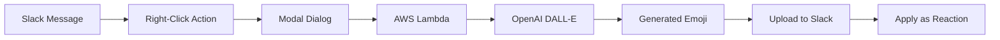

# Emoji Smith 🎨

[](https://codecov.io/gh/willtech3/emoji-smith)

> **AI-powered custom emoji generator for Slack workspaces**

Emoji Smith is a Slack bot that automatically generates custom emojis using OpenAI's DALL-E, triggered by message actions. Simply right-click any Slack message, choose "Create Reaction," describe the emoji you want, and watch as AI creates the perfect custom emoji reaction.

## ✨ Features

- **🎯 Context-Aware Generation**: Analyzes the original message for relevant emoji creation
- **🎨 Style Customization**: Choose from cartoon, realistic, minimalist, or pixel art styles
- **⚡ Instant Application**: Generated emoji is automatically added as a reaction
- **🔒 Secure Deployment**: AWS Lambda with proper secrets management
- **🚀 Zero Downtime**: Serverless architecture scales automatically

## 🏗️ Architecture



**Tech Stack:**
- **Backend**: Python 3.12 + FastAPI + Slack Bolt
- **AI Services**: OpenAI o3 with fallback to gpt-4/gpt-3.5 (prompt enhancement) + DALL-E (image generation)
- **Infrastructure**: AWS Lambda + API Gateway + SQS + Secrets Manager
- **Deployment**: AWS CDK + GitHub Actions
- **Monitoring**: CloudWatch logs + health check endpoint (`/health`)
- **Security**: Bandit SAST scanning + least-privilege IAM

## 🚀 Quick Start

### Prerequisites

- Python 3.12+
- AWS Account with CDK bootstrapped
- Slack workspace (admin access)
- OpenAI API key

### 1. Local Development Setup

```bash
# Clone and setup environment
git clone https://github.com/willtech3/emoji-smith.git
cd emoji-smith
uv venv && source .venv/bin/activate
uv pip install -e ".[dev]"

# Configure environment
cp .env.example .env
# Edit .env with your Slack and OpenAI credentials

# Verify setup
pytest -q && black --check src/ && bandit -r src/
```

### 2. Slack App Configuration

1. Create new Slack app at [api.slack.com/apps](https://api.slack.com/apps)
2. Add bot scopes: `emoji:write`, `reactions:write`, `commands`, `chat:write`
3. Create message action: "Create Reaction" with callback ID `create_emoji_reaction`
4. Install app to workspace and copy tokens to `.env`

### 3. Local Testing

```bash
# Terminal 1: Start development server
python -m src.emojismith.dev_server

# Terminal 2: Expose via ngrok
ngrok http 8000

# Update Slack app webhook URL to ngrok HTTPS URL
```

### 4. Production Deployment

```bash
# Bootstrap AWS CDK (one-time)
cdk bootstrap

# Deploy infrastructure
cd infra && cdk deploy

# Configure GitHub secrets for CI/CD
gh secret set AWS_ACCESS_KEY_ID -b "<from-cdk-output>"
gh secret set AWS_SECRET_ACCESS_KEY -b "<from-cdk-output>"

# Store production secrets in AWS Secrets Manager
aws secretsmanager create-secret --name "emoji-smith/production" --secret-string '{...}'
```

## 📖 Usage

1. **Find a message** in Slack that needs a reaction
2. **Right-click** the message → **More actions** → **Create Reaction**
3. **Describe the emoji** you want in the modal dialog
4. **Choose sharing options**:
   - Where to share (new thread, existing thread, or direct message)
   - Who sees instructions (everyone or just you)
   - Image size (emoji size 128x128 or full size 1024x1024)
5. **Submit** and wait 5-10 seconds for AI generation
6. **For Enterprise Grid**: Emoji automatically uploaded and added as reaction
7. **For Standard Workspaces**: Emoji shared as file with easy upload instructions

### Example Use Cases

- **"facepalm but cute"** on deployment failure messages
- **"celebrating with confetti"** on successful releases
- **"this is fine dog"** on system alerts
- **"mind blown explosion"** on brilliant ideas
- **"typing furiously"** on coding discussions

## ⚙️ Configuration

### Environment Variables

| Variable | Description | Default | Values |
|----------|-------------|---------|---------|
| `SLACK_BOT_TOKEN` | Slack bot user OAuth token | Required | `xoxb-...` |
| `SLACK_SIGNING_SECRET` | Slack app signing secret | Required | `...` |
| `OPENAI_API_KEY` | OpenAI API key for DALL-E | Required | `sk-...` |
| `OPENAI_CHAT_MODEL` | Chat model for prompt enhancement | `o3` | `o3`, `gpt-4`, `gpt-3.5-turbo` |
| `EMOJISMITH_FORCE_ENTERPRISE` | Force Enterprise Grid mode | `false` | `true`, `false` |
| `SQS_QUEUE_URL` | AWS SQS queue URL (production) | None | AWS SQS URL |
| `AWS_SECRETS_NAME` | AWS Secrets Manager name | None | `emoji-smith/production` |

**Note on `EMOJISMITH_FORCE_ENTERPRISE`**: This environment variable allows you to simulate Enterprise Grid workspace behavior in development/testing. When set to `true`, the bot will attempt direct emoji uploads. Invalid values (anything other than `true` or `false`) will log a warning and default to `false`.

## 🛠️ Development

### Feature Branch Workflow

```bash
# Create feature branch
git checkout -b feature/your-feature-name

# Make changes with security in mind
git add src/specific/files.py tests/specific/test_files.py  # NEVER use 'git add .'
git commit -m "feat: your descriptive message"

# Push and create PR
git push origin feature/your-feature-name
gh pr create --title "Your Feature" --body "Description"
```

### Dependency Injection Quickstart

When embedding Emoji Smith in another FastAPI or async context, simply provide your own Slack client and inject a `SlackFileSharingRepository`:

```python
from slack_sdk.web.async_client import AsyncWebClient
from emojismith.infrastructure.slack.slack_file_sharing import SlackFileSharingRepository

slack_client = AsyncWebClient(token="xoxb-…")
file_sharing_repo = SlackFileSharingRepository(slack_client)
# pass `file_sharing_repo` into `EmojiCreationService`
```

If you don’t provide one, `create_webhook_app()` auto-constructs a default instance for the dev server.

### Quality Checks

All code must pass these checks before merging:

```bash
black --check src/ tests/     # Code formatting
flake8 src/ tests/           # Style linting
mypy src/                    # Type checking
bandit -r src/               # Security scanning
pytest --cov=src tests/      # Tests with 90%+ coverage
```

### CI/CD Pipeline

**Stage 1: Code Quality** → **Stage 2: Security** → **Stage 3: Testing** → **Stage 4: Build** → **Stage 5: Deploy**

- **Pull Requests**: Run stages 1-3 for validation
- **Main Branch**: Run all stages including production deployment
- **Deployment**: Automatic via AWS CDK when main branch updated

## 🔒 Security

- **🚫 No hardcoded secrets**: All credentials via environment variables or AWS Secrets Manager
- **🔍 SAST scanning**: Bandit security analysis on every commit
- **🔐 Least privilege**: IAM roles with minimal required permissions
- **📝 Explicit commits**: Never use `git add .` - always specify files explicitly
- **🛡️ Branch protection**: All changes require pull request review

## 📁 Project Structure (DDD Architecture)

```
emoji-smith/
├── src/emojismith/          # Main application (Clean Architecture)
│   ├── domain/             # 🏛️  Domain Layer (pure business logic)
│   │   ├── entities/       # Core business objects
│   │   ├── value_objects/  # Immutable domain concepts
│   │   ├── services/       # Domain business rules
│   │   └── repositories/   # Repository interfaces (abstractions)
│   ├── application/        # 🎯 Application Layer (use cases)
│   │   ├── services/       # Application services (orchestration)
│   │   └── handlers/       # Slack webhook handlers
│   ├── infrastructure/     # 🔧 Infrastructure Layer (external concerns)
│   │   ├── slack/          # Slack API implementations
│   │   ├── openai/         # OpenAI API implementations
│   │   └── aws/            # AWS service integrations
│   │       ├── lambda_handler.py   # AWS Lambda entrypoint
│   │       ├── webhook_handler.py  # FastAPI webhook handler
│   │       └── worker_handler.py   # SQS worker handler
│   ├── app.py             # FastAPI application factory
│   └── dev_server.py       # Local development server
├── tests/                  # 🧪 Test Suite (TDD)
│   ├── unit/              # Domain and application logic tests
│   ├── integration/       # Infrastructure integration tests
│   └── fixtures/          # Test data and mocks
├── infra/                 # ☁️  AWS CDK Infrastructure
├── .github/workflows/     # 🚀 CI/CD Pipeline
└── docs/                  # 📚 Documentation
```

## 🤝 Contributing

1. **Read the guidelines**: See [CLAUDE.md](./CLAUDE.md) for development standards
2. **Follow security rules**: Never commit secrets, always use explicit file adds
3. **Write tests**: Test-driven development with 90%+ coverage
4. **Use feature branches**: All changes via pull request
5. **Run quality checks**: Ensure all tools pass before committing

## 📄 License

MIT License - see [LICENSE](./LICENSE) for details.

## 🆘 Support

- **Setup Issues**: See [SETUP.md](./SETUP.md) for detailed instructions
- **Development**: See [CLAUDE.md](./CLAUDE.md) for coding guidelines
- **Bug Reports**: [Open an issue](https://github.com/willtech3/emoji-smith/issues)
- **Feature Requests**: [Start a discussion](https://github.com/willtech3/emoji-smith/discussions)

---

**Made with ❤️ and AI** • Powered by OpenAI DALL-E • Deployed on AWS Lambda
