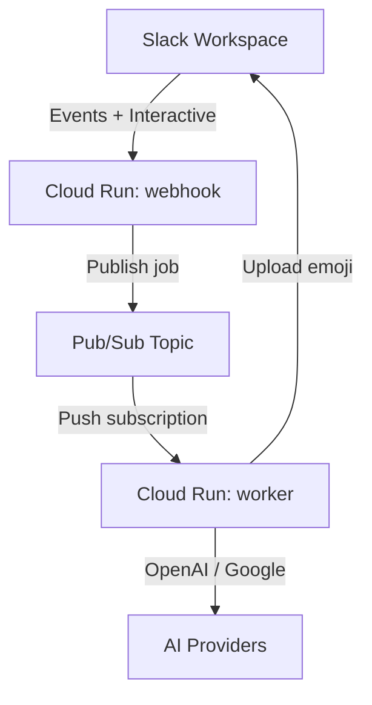

# Emoji Smith 🎨

[](https://codecov.io/gh/willtech3/emoji-smith)

> **AI-powered custom emoji generator for Slack workspaces**

Emoji Smith is a Slack bot that generates custom emoji reactions using AI (OpenAI + Google). Right-click any Slack message, choose “Create Reaction”, describe what you want, and Emoji Smith will generate an emoji and help apply it.

## ✨ Features

- **🎯 Context-aware generation**: Uses the original message for better emojis
- **🎨 Style customization**: Multiple styles and quality options
- **🔄 Multi-provider**: OpenAI + Google image generation
- **⚡ Fast Slack response**: Webhook responds within Slack’s 3-second timeout
- **🔒 Secure deployment**: GCP Secret Manager + least privilege service accounts
- **🚀 Serverless runtime**: Cloud Run + Pub/Sub

## 🏗️ Architecture (Production)



For deployment details, see the Terraform configuration in `terraform/`.

**Tech Stack**
- **Backend**: Python 3.12 + FastAPI
- **AI**: OpenAI (prompt enhancement + image generation), Google Gemini (optional)
- **Infrastructure**: GCP Cloud Run + Pub/Sub + Secret Manager + Artifact Registry
- **IaC**: Terraform (`terraform/`)
- **CI/CD**: GitHub Actions with Workload Identity Federation (`.github/workflows/deploy-gcp.yml`)
- **Monitoring**: Cloud Logging

## 🚀 Quick Start

### Prerequisites

- Python 3.12+
- `uv`
- Slack workspace (admin access)
- OpenAI API key
- Optional: Google API key (enables Gemini provider)

### 1) Local Development Setup

```bash
git clone https://github.com/willtech3/emoji-smith.git
cd emoji-smith
uv venv && source .venv/bin/activate
uv sync --all-extras --dev
cp .env.example .env
```

Edit `.env` with your values (at minimum):
- `SLACK_BOT_TOKEN`
- `SLACK_SIGNING_SECRET`
- `OPENAI_API_KEY`
- `PUBSUB_PROJECT`
- `PUBSUB_TOPIC`

### 2) Slack App Configuration

1. Create a Slack app at `api.slack.com/apps`
2. Add bot scopes: `emoji:write`, `reactions:write`, `commands`, `chat:write`
3. Create a message action: “Create Reaction” with callback ID `create_emoji_reaction`
4. Install app to workspace and copy tokens to `.env`

### 3) Local Testing

```bash
# Terminal 1
python -m emojismith.dev_server

# Terminal 2
ngrok http 8000
```

Update the Slack app request URLs to your `ngrok` HTTPS endpoint.

### 4) Production Deployment (GCP)

High level:
- Terraform provisions infra in `terraform/` (Cloud Run, Pub/Sub, Secret Manager, Artifact Registry, IAM/WIF).
- App deploys happen via GitHub Actions (`.github/workflows/deploy-gcp.yml`).

See the Terraform configuration in `terraform/` for infrastructure details.

## ⚙️ Configuration

| Variable | Description | Required |
|----------|-------------|----------|
| `SLACK_BOT_TOKEN` | Slack bot user OAuth token | Yes |
| `SLACK_SIGNING_SECRET` | Slack signing secret (request verification) | Yes (webhook) |
| `OPENAI_API_KEY` | OpenAI API key | Yes |
| `OPENAI_CHAT_MODEL` | Chat model for prompt enhancement | No (default: `gpt-5`) |
| `GOOGLE_API_KEY` | Google API key (Gemini provider) | No |
| `PUBSUB_PROJECT` | GCP project ID for Pub/Sub | Yes |
| `PUBSUB_TOPIC` | Pub/Sub topic name | Yes |
| `EMOJISMITH_FORCE_ENTERPRISE` | Force Enterprise Grid mode | No |
| `SLACK_TEST_BOT_TOKEN` | Token for Slack integration tests | No |
| `SLACK_TEST_CHANNEL_ID` | Channel ID for Slack integration tests | No |
| `SLACK_TEST_USER_ID` | User ID for Slack integration tests | No |

## 🛠️ Development

### Quality Checks

```bash
just qa
```

### Feature Branch Workflow

```bash
git checkout -b feature/your-feature-name
just qa
git add src/path/to/file.py tests/path/to/test_file.py  # never git add .
git commit -m "feat: your change"
git push origin feature/your-feature-name
gh pr create --title "feat: your change" --body "..."
```

## 📁 Project Structure (DDD)

```
emoji-smith/
├── src/
│   ├── emojismith/
│   │   ├── domain/
│   │   ├── application/
│   │   ├── infrastructure/
│   │   │   ├── gcp/        # Cloud Run + Pub/Sub adapters
│   │   │   ├── slack/      # Slack API adapters
│   │   │   ├── openai/     # OpenAI adapters
│   │   │   └── google/     # Gemini adapters
│   │   └── presentation/
│   └── shared/
├── terraform/
├── tests/
└── docs/
```

## 📚 Documentation

- `terraform/` - GCP infrastructure as code (Cloud Run + Pub/Sub)
- `docs/adr/` - Architecture Decision Records
- `docs/guides/testing.md` - Testing guidelines
- `CLAUDE.md` and co-located `CLAUDE.md` files - Coding and workflow rules

## 🆘 Support

- **Development rules**: `CLAUDE.md`
- **Deployment/architecture**: `terraform/` and architecture section above
- **Testing**: `docs/guides/testing.md`
- **Issues**: https://github.com/willtech3/emoji-smith/issues

