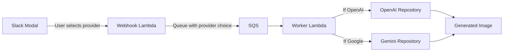

# Multi-Provider Image Generation Specification

> **Adding Google Gemini (Nano Banana Pro) alongside OpenAI for user-selectable image generation**

## Overview

This document specifies adding **Google Gemini** as an additional image generation provider alongside the existing **OpenAI** integration. Users will be able to select their preferred model provider from the Slack UI, and the worker will generate images using the chosen provider.

### Provider Comparison

| Provider | Primary Model | Fallback Model | Prompt Enhancement |
|----------|---------------|----------------|-------------------|
| **OpenAI** | `gpt-image-1` | `gpt-image-1-mini` | GPT-5 (existing) |
| **Google Gemini** | `gemini-3-pro-image-preview` (Nano Banana Pro) | `gemini-2.5-flash-image` (Nano Banana) | Optional (Gemini Flash) |

### OpenAI Image Models (December 2025)

| Model | API String | Best For | Max Resolution |
|-------|------------|----------|----------------|
| **GPT-Image-1.5** | `gpt-image-1.5` | Highest quality, complex prompts | 1536x1024 / 1024x1536 |
| **GPT-Image-1** | `gpt-image-1` | High quality, stable | 1024x1024 |
| **GPT-Image-1-mini** | `gpt-image-1-mini` | Fast, cost-effective, great for emojis | 1024x1024 |
| **DALL-E 3** | `dall-e-3` | **DEPRECATED** - ends May 12, 2026 (2026-05-12) | N/A |

**Source:** [OpenAI Images API Reference](https://platform.openai.com/docs/api-reference/images/), [OpenAI Deprecations](https://platform.openai.com/docs/deprecations)

### Google Gemini Models

| Model | API String | Best For | Resolution |
|-------|------------|----------|------------|
| **Nano Banana Pro** | `gemini-3-pro-image-preview` | High-fidelity, text rendering | Up to 4096px |
| **Nano Banana** | `gemini-2.5-flash-image` | Fast generation | 1024px base (varies by aspect ratio) |

**Source:** [Gemini Image Generation Docs](https://ai.google.dev/gemini-api/docs/image-generation)

---

## Architecture Overview



### Current SQS Serialization Architecture

**IMPORTANT:** The current codebase serializes `EmojiGenerationJob.to_dict()` directly to SQS, NOT `QueueMessage`. The worker parses `EmojiGenerationJob.from_dict()` from the message body.

```
Producer (webhook): job.to_dict() → JSON → SQS
Consumer (worker):  JSON → EmojiGenerationJob.from_dict() → process
```

**Migration approach:** Add `image_provider` field to `EmojiGenerationJob` with default `"openai"` for backward compatibility.

---

## Implementation Checklist

### Phase 1: Update Domain Layer

- [ ] **1.1** Create unified image generation repository protocol
  - File: **[NEW]** `src/emojismith/domain/repositories/image_generation_repository.py`
  - Create abstract protocol that both OpenAI and Gemini repositories implement
  - Content:
    ```python
    """Image generation repository protocol."""

    from typing import Protocol


    class ImageGenerationRepository(Protocol):
        """Protocol for image generation providers."""

        async def generate_image(self, prompt: str) -> bytes:
            """Generate an image from the given prompt.

            Args:
                prompt: The text description for image generation.

            Returns:
                Raw image bytes (PNG format).

            Raises:
                RateLimitExceededError: When API rate limit is hit.
                ValueError: When generation fails or returns no data.
            """
            ...
    ```

- [ ] **1.2** Create provider enum for image generation
  - File: **[NEW]** `src/emojismith/domain/value_objects/image_provider.py`
  - Content:
    ```python
    """Image provider value object."""

    from enum import Enum


    class ImageProvider(str, Enum):
        """Available image generation providers."""

        OPENAI = "openai"
        GOOGLE_GEMINI = "google_gemini"

        @classmethod
        def from_string(cls, value: str) -> "ImageProvider":
            """Create provider from string, defaulting to OpenAI."""
            try:
                return cls(value.lower())
            except ValueError:
                return cls.OPENAI
    ```

- [ ] **1.3** Update `EmojiGenerationJob` entity to include provider selection
  - File: **[MODIFY]** `src/shared/domain/entities/__init__.py`
  - **CRITICAL:** This is where SQS serialization happens - NOT QueueMessage!
  - Add field: `image_provider: str = "openai"` (use string for JSON serialization)
  - Update `to_dict()` to include: `"image_provider": self.image_provider`
  - Update `from_dict()` to parse: `image_provider=data.get("image_provider", "openai")`
  - Example modification:
    ```python
    @dataclass
    class EmojiGenerationJob:
        # ... existing fields ...
        image_provider: str = "openai"  # Default for backward compatibility

        def to_dict(self) -> dict[str, Any]:
            return {
                # ... existing fields ...
                "image_provider": self.image_provider,
            }

        @classmethod
        def from_dict(cls, data: dict[str, Any]) -> "EmojiGenerationJob":
            return cls(
                # ... existing fields ...
                image_provider=data.get("image_provider", "openai"),
            )
    ```

- [ ] **1.4** Export new types from domain layer
  - File: **[MODIFY]** `src/emojismith/domain/value_objects/__init__.py`
  - Add: `from .image_provider import ImageProvider`
  - File: **[MODIFY]** `src/emojismith/domain/repositories/__init__.py`
  - Add: `from .image_generation_repository import ImageGenerationRepository`

---

### Phase 2: Update OpenAI Implementation (Fix Deprecated Fallback + Add Transparency)

- [ ] **2.1** Update OpenAI fallback from deprecated DALL-E 3 to gpt-image-1-mini
  - File: **[MODIFY]** `src/emojismith/infrastructure/openai/openai_api.py`
  - Change fallback model from `dall-e-3` to `gpt-image-1-mini`
  - Add `background="transparent"` parameter for better emoji output

  ```python
  async def generate_image(self, prompt: str) -> bytes:
      """Generate image using gpt-image-1 with fallback to gpt-image-1-mini."""
      try:
          response = await self._client.images.generate(
              model="gpt-image-1",
              prompt=prompt,
              n=1,
              size="1024x1024",
              quality="high",
              background="transparent",  # Better for emojis
          )
      except openai.RateLimitError as exc:
          raise RateLimitExceededError(str(exc)) from exc
      except Exception as exc:
          self._logger.warning(
              "gpt-image-1 failed, falling back to gpt-image-1-mini: %s", exc
          )
          # Fallback to gpt-image-1-mini (fast, cost-effective)
          try:
              response = await self._client.images.generate(
                  model="gpt-image-1-mini",
                  prompt=prompt,
                  n=1,
                  size="1024x1024",
                  background="transparent",
              )
          except openai.RateLimitError as rate_exc:
              raise RateLimitExceededError(str(rate_exc)) from rate_exc

      # ... rest of method unchanged
  ```

- [ ] **2.2** Make OpenAI repository implement new protocol
  - File: **[MODIFY]** `src/emojismith/infrastructure/openai/openai_api.py`
  - Add import: `from emojismith.domain.repositories.image_generation_repository import ImageGenerationRepository`
  - Update class signature to implement both protocols:
    ```python
    class OpenAIAPIRepository(OpenAIRepository, ImageGenerationRepository):
    ```

---

### Phase 3: Add Google Gemini Infrastructure

- [ ] **3.1** Add `google-genai` dependency
  - File: **[MODIFY]** `pyproject.toml`
  - Add to `dependencies` list: `"google-genai>=1.0.0"`

- [ ] **3.2** Add `google-genai` to Dockerfile (worker Lambda container)
  - File: **[MODIFY]** `Dockerfile`
  - Add to pip install line: `google-genai>=1.0.0 \`
  - **CRITICAL:** The Dockerfile installs dependencies directly, NOT from pyproject.toml

- [ ] **3.3** Add `GOOGLE_API_KEY` to environment configuration
  - File: **[MODIFY]** `.env.example`
  - Add line: `GOOGLE_API_KEY=your-google-api-key-here`

- [ ] **3.4** Update AWS Secrets Manager and CDK for Google API key
  - File: **[MODIFY]** `infra/stacks/emoji_smith_stack.py`
  - Add `GOOGLE_API_KEY` to worker Lambda environment variables (lines ~304-320):
    ```python
    environment={
        # ... existing vars ...
        "GOOGLE_API_KEY": self.secrets.secret_value_from_json(
            "GOOGLE_API_KEY"
        ).unsafe_unwrap(),
    },
    ```

- [ ] **3.5** Create Google infrastructure directory with __init__
  - Directory: **[NEW]** `src/emojismith/infrastructure/google/`
  - File: **[NEW]** `src/emojismith/infrastructure/google/__init__.py`
  - Content:
    ```python
    """Google Gemini infrastructure implementations."""

    from .gemini_api import GeminiAPIRepository

    __all__ = ["GeminiAPIRepository"]
    ```

- [ ] **3.6** Implement Gemini API Repository (NATIVE ASYNC VERSION)
  - File: **[NEW]** `src/emojismith/infrastructure/google/gemini_api.py`
  - **IMPORTANT:** Use `client.aio.models.generate_content()` for native async
  - **IMPORTANT:** Set `response_modalities=["IMAGE"]` when requesting images
  - **NOTE:** `contents` accepts both string and list - string is fine for text-only prompts
  - Content:
    ```python
    """Google Gemini API repository implementation."""

    from __future__ import annotations

    import logging

    from google import genai
    from google.genai import types

    from emojismith.domain.errors import RateLimitExceededError
    from emojismith.domain.repositories.image_generation_repository import (
        ImageGenerationRepository,
    )


    class GeminiAPIRepository(ImageGenerationRepository):
        """Concrete Gemini repository for image generation.

        Uses native async via client.aio for optimal performance.
        """

        def __init__(
            self,
            client: genai.Client,
            model: str = "gemini-3-pro-image-preview",
            fallback_model: str = "gemini-2.5-flash-image",
        ) -> None:
            self._client = client
            self._logger = logging.getLogger(__name__)
            self._model = model
            self._fallback_model = fallback_model

        async def _generate_with_model(self, prompt: str, model: str) -> bytes:
            """Generate image with specified model using native async."""
            response = await self._client.aio.models.generate_content(
                model=model,
                contents=prompt,  # String is supported (list optional for multi-modal)
                config=types.GenerateContentConfig(
                    response_modalities=["IMAGE"],  # Required for image output
                    image_config=types.ImageConfig(
                        aspect_ratio="1:1",  # Square for emoji
                    ),
                ),
            )

            for part in response.parts:
                if part.inline_data:
                    return part.inline_data.data

            raise ValueError("Gemini did not return image data")

        async def generate_image(self, prompt: str) -> bytes:
            """Generate image using Gemini with fallback."""
            try:
                return await self._generate_with_model(prompt, self._model)
            except Exception as exc:
                error_str = str(exc).lower()
                if "rate" in error_str or "quota" in error_str:
                    raise RateLimitExceededError(str(exc)) from exc

                self._logger.warning(
                    "%s failed, falling back to %s: %s",
                    self._model,
                    self._fallback_model,
                    exc,
                )

                try:
                    return await self._generate_with_model(prompt, self._fallback_model)
                except Exception as fallback_exc:
                    error_str = str(fallback_exc).lower()
                    if "rate" in error_str or "quota" in error_str:
                        raise RateLimitExceededError(str(fallback_exc)) from fallback_exc
                    raise fallback_exc
    ```

---

### Phase 4: Create Provider Factory (DDD Compliant)

- [ ] **4.1** Create factories directory with __init__
  - Directory: **[NEW]** `src/emojismith/infrastructure/factories/`
  - File: **[NEW]** `src/emojismith/infrastructure/factories/__init__.py`
  - Content:
    ```python
    """Infrastructure factories."""

    from .image_generator_factory import ImageGeneratorFactory

    __all__ = ["ImageGeneratorFactory"]
    ```

- [ ] **4.2** Create image generation factory (NO direct os.getenv)
  - File: **[NEW]** `src/emojismith/infrastructure/factories/image_generator_factory.py`
  - **IMPORTANT**: API keys are injected, not read from environment (per CLAUDE.md)
  - Content:
    ```python
    """Factory for creating image generation repositories."""

    from __future__ import annotations

    from typing import TYPE_CHECKING

    from google import genai
    from openai import AsyncOpenAI

    from emojismith.domain.value_objects.image_provider import ImageProvider
    from emojismith.infrastructure.google.gemini_api import GeminiAPIRepository
    from emojismith.infrastructure.openai.openai_api import OpenAIAPIRepository

    if TYPE_CHECKING:
        from emojismith.domain.repositories.image_generation_repository import (
            ImageGenerationRepository,
        )


    class ImageGeneratorFactory:
        """Factory to create the appropriate image generator based on provider.

        API keys are injected via constructor following DDD principles
        (no direct os.getenv access per CLAUDE.md guidelines).
        """

        def __init__(
            self,
            openai_api_key: str | None = None,
            google_api_key: str | None = None,
        ) -> None:
            """Initialize factory with API keys.

            Args:
                openai_api_key: OpenAI API key (required for OpenAI provider).
                google_api_key: Google API key (required for Gemini provider).
            """
            self._openai_api_key = openai_api_key
            self._google_api_key = google_api_key

        def create(self, provider: ImageProvider) -> ImageGenerationRepository:
            """Create an image generator for the specified provider.

            Args:
                provider: The image generation provider to use.

            Returns:
                An image generation repository instance.

            Raises:
                ValueError: If required API key is not configured.
            """
            if provider == ImageProvider.OPENAI:
                if not self._openai_api_key:
                    raise ValueError("OPENAI_API_KEY required for OpenAI provider")
                client = AsyncOpenAI(api_key=self._openai_api_key)
                return OpenAIAPIRepository(client)

            elif provider == ImageProvider.GOOGLE_GEMINI:
                if not self._google_api_key:
                    raise ValueError("GOOGLE_API_KEY required for Gemini provider")
                client = genai.Client(api_key=self._google_api_key)
                return GeminiAPIRepository(client)

            else:
                raise ValueError(f"Unsupported provider: {provider}")
    ```

---

### Phase 5: Update Worker to Use Provider Selection

- [ ] **5.1** Update application layer to accept provider selection
  - File: **[MODIFY]** `src/emojismith/application/services/emoji_service.py`
  - Modify service to accept `ImageGeneratorFactory` and use provider from job
  - Example modification:
    ```python
    def __init__(
        self,
        image_generator_factory: ImageGeneratorFactory,
        # ... other dependencies
    ) -> None:
        self._image_generator_factory = image_generator_factory
        # ...

    async def process_emoji_generation_job(self, job: EmojiGenerationJob) -> None:
        """Process job using selected provider."""
        provider = ImageProvider.from_string(job.image_provider)
        image_generator = self._image_generator_factory.create(provider)
        image_bytes = await image_generator.generate_image(job.enhanced_prompt)
        # ...
    ```

- [ ] **5.2** Update `app.py` to construct factory with both API keys
  - File: **[MODIFY]** `src/emojismith/app.py`
  - Import and construct `ImageGeneratorFactory` with keys from settings/secrets
  - Pass factory to services instead of individual repositories

---

### Phase 6: Update Slack UI for Provider Selection

- [ ] **6.1** Add provider selection dropdown to modal
  - File: Find Slack modal/view builder (likely in `application/handlers/` or `presentation/`)
  - Add static select with options:
    ```python
    {
        "type": "input",
        "block_id": "image_provider_block",
        "element": {
            "type": "static_select",
            "action_id": "image_provider_select",
            "placeholder": {"type": "plain_text", "text": "Select image model"},
            "options": [
                {
                    "text": {"type": "plain_text", "text": "OpenAI GPT-Image"},
                    "value": "openai"
                },
                {
                    "text": {"type": "plain_text", "text": "Google Gemini (Nano Banana Pro)"},
                    "value": "google_gemini"
                }
            ],
            "initial_option": {
                "text": {"type": "plain_text", "text": "OpenAI GPT-Image"},
                "value": "openai"
            }
        },
        "label": {"type": "plain_text", "text": "Image Model"}
    }
    ```

- [ ] **6.2** Update modal submission handler to capture provider selection
  - File: **[MODIFY]** `src/emojismith/application/handlers/slack_webhook_handler.py`
  - Extract value using: `view["state"]["values"]["image_provider_block"]["image_provider_select"]["selected_option"]["value"]`
  - Pass to `EmojiGenerationJob.create_new()` as `image_provider=selected_value`

- [ ] **6.3** Update job creation to include provider in EmojiGenerationJob
  - File: Find where `EmojiGenerationJob.create_new()` is called
  - Add `image_provider` parameter from the extracted modal value
  - **NOTE:** The job is serialized directly to SQS via `job.to_dict()` in `sqs_job_queue.py` line 27

---

### Phase 7: Update Tests

- [ ] **7.1** Create tests for ImageProvider value object
  - File: **[NEW]** `tests/unit/domain/value_objects/test_image_provider.py`
  - Tests:
    - `test_from_string_when_openai_value_returns_openai_provider`
    - `test_from_string_when_google_gemini_value_returns_gemini_provider`
    - `test_from_string_when_invalid_value_returns_openai_default`
    - `test_from_string_when_uppercase_value_is_case_insensitive`

- [ ] **7.2** Create tests for Gemini repository
  - Directory: **[NEW]** `tests/contract/google/`
  - File: **[NEW]** `tests/contract/google/__init__.py`
  - File: **[NEW]** `tests/contract/google/test_gemini_api.py`
  - Tests:
    - `test_generate_image_when_successful_returns_bytes`
    - `test_generate_image_when_primary_fails_uses_fallback`
    - `test_generate_image_when_quota_exceeded_raises_rate_limit_error`
    - `test_generate_image_uses_native_async_client`

- [ ] **7.3** Create tests for factory
  - Directory: **[NEW]** `tests/unit/infrastructure/factories/`
  - File: **[NEW]** `tests/unit/infrastructure/factories/__init__.py`
  - File: **[NEW]** `tests/unit/infrastructure/factories/test_image_generator_factory.py`
  - Tests:
    - `test_create_when_openai_selected_returns_openai_repository`
    - `test_create_when_gemini_selected_returns_gemini_repository`
    - `test_create_when_openai_key_missing_raises_value_error`
    - `test_create_when_google_key_missing_raises_value_error`

- [ ] **7.4** Update existing OpenAI tests for new fallback model and background param
  - File: **[MODIFY]** `tests/contract/openai/` (add test file if empty)
  - Update expected fallback model from `dall-e-3` to `gpt-image-1-mini`
  - Add test for `background="transparent"` parameter

- [ ] **7.5** Add tests for EmojiGenerationJob image_provider field
  - File: **[MODIFY]** `tests/unit/domain/entities/test_emoji_generation_job_sharing.py` or create new
  - Tests:
    - `test_to_dict_when_default_provider_includes_openai`
    - `test_from_dict_when_provider_missing_defaults_to_openai`
    - `test_from_dict_when_provider_present_preserves_value`

- [ ] **7.6** Add tests for provider selection in modal handler
  - File: Find existing modal handler tests
  - Add test case for provider extraction from submission

---

### Phase 8: Documentation Updates

- [ ] **8.1** Update README.md
  - File: **[MODIFY]** `README.md`
  - Add section about multi-provider support
  - Update environment variables table with `GOOGLE_API_KEY`

- [ ] **8.2** Update SETUP.md
  - File: **[MODIFY]** `SETUP.md`
  - Add instructions for Google API key setup
  - Link to Google AI Studio for key generation: https://aistudio.google.com/

- [ ] **8.3** Update architecture documentation
  - File: **[MODIFY]** `docs/architecture/dual-lambda.md`
  - Add diagram showing multi-provider architecture
  - Document provider selection flow

---

## Verification Plan

### Automated Tests

```bash
# Run all tests
pytest tests/ -v

# Run new value object tests
pytest tests/unit/domain/value_objects/test_image_provider.py -v

# Run new Gemini repository tests
pytest tests/contract/google/ -v

# Run factory tests
pytest tests/unit/infrastructure/factories/ -v

# Run EmojiGenerationJob tests
pytest tests/unit/domain/entities/ -v

# Quality checks
./scripts/check-quality.sh
```

### Manual Verification

1. **Test OpenAI Provider (Default)**:
   ```bash
   export OPENAI_API_KEY="your-key"
   export SLACK_BOT_TOKEN="xoxb-..."
   python -m src.emojismith.dev_server
   ```
   - Open Slack -> Right-click message -> "Create Reaction"
   - Verify "OpenAI GPT-Image" is selected by default
   - Submit -> Verify emoji is generated with transparent background

2. **Test Google Gemini Provider**:
   ```bash
   export GOOGLE_API_KEY="your-key"
   # ... start dev server
   ```
   - Open modal -> Select "Google Gemini (Nano Banana Pro)"
   - Submit -> Verify emoji is generated using Gemini

3. **Test Fallback Behavior**:
   - Temporarily set invalid primary model name
   - Verify fallback model is used
   - Check logs for warning messages

4. **Test Backward Compatibility**:
   - Send a job to SQS without `image_provider` field
   - Verify worker defaults to OpenAI and processes successfully

---

## API Reference

### OpenAI Image Generation

```python
from openai import AsyncOpenAI

client = AsyncOpenAI(api_key="YOUR_API_KEY")

response = await client.images.generate(
    model="gpt-image-1",      # or "gpt-image-1-mini" for faster/cheaper
    prompt="Your prompt here",
    n=1,
    size="1024x1024",         # Max: 1536x1024 or 1024x1536
    quality="high",           # Options: "low", "medium", "high", "auto"
    background="transparent", # Options: "transparent", "opaque", "auto"
)

image_b64 = response.data[0].b64_json
```

**Source:** [OpenAI Images API Reference](https://platform.openai.com/docs/api-reference/images/)

### Google Gemini Image Generation

```python
from google import genai
from google.genai import types

client = genai.Client(api_key="YOUR_API_KEY")

# Native async version (recommended)
response = await client.aio.models.generate_content(
    model="gemini-3-pro-image-preview",
    contents="Your prompt here",  # String or list for multi-modal
    config=types.GenerateContentConfig(
        response_modalities=["IMAGE"],  # Required for image output
        image_config=types.ImageConfig(
            aspect_ratio="1:1",
        ),
    ),
)

for part in response.parts:
    if part.inline_data:
        image_bytes = part.inline_data.data
```

**Available Aspect Ratios**: `1:1`, `2:3`, `3:2`, `3:4`, `4:3`, `4:5`, `5:4`, `9:16`, `16:9`, `21:9`

**Source:** [Gemini Image Generation Docs](https://ai.google.dev/gemini-api/docs/image-generation), [Google GenAI SDK](https://googleapis.github.io/python-genai/)

---

## Configuration

### Environment Variables

| Variable | Description | Required |
|----------|-------------|----------|
| `OPENAI_API_KEY` | OpenAI API key | Yes (for OpenAI provider) |
| `GOOGLE_API_KEY` | Google AI API key | Yes (for Gemini provider) |
| `OPENAI_CHAT_MODEL` | Model for prompt enhancement | Optional (default: `gpt-5`) |

### AWS Secrets Manager

Add both keys to your secrets:
```json
{
  "SLACK_BOT_TOKEN": "xoxb-...",
  "SLACK_SIGNING_SECRET": "...",
  "OPENAI_API_KEY": "sk-...",
  "GOOGLE_API_KEY": "AIza..."
}
```

---

## Notes for AI Implementers

### Critical Implementation Details

1. **Add `image_provider` to `EmojiGenerationJob`**, NOT `QueueMessage` - the SQS serialization uses `EmojiGenerationJob.to_dict()` directly
2. **Gemini SDK has native async**: Use `client.aio.models.generate_content()`, NOT `asyncio.to_thread()`
3. **Gemini `contents` accepts string or list**: String is fine for text-only prompts
4. **Set `response_modalities=["IMAGE"]`** when requesting images from Gemini
5. **Use `background="transparent"`** for OpenAI instead of relying on prompt text
6. **DALL-E 3 is deprecated** (ends May 12, 2026): Use `gpt-image-1-mini` as fallback
7. **Dockerfile installs deps directly**: Add `google-genai` to Dockerfile pip install, not just pyproject.toml
8. **CDK injects secrets as env vars**: Add `GOOGLE_API_KEY` to worker Lambda environment

### Files to Create (Complete List)

```
src/emojismith/domain/repositories/image_generation_repository.py
src/emojismith/domain/value_objects/image_provider.py
src/emojismith/infrastructure/google/__init__.py
src/emojismith/infrastructure/google/gemini_api.py
src/emojismith/infrastructure/factories/__init__.py
src/emojismith/infrastructure/factories/image_generator_factory.py
tests/contract/google/__init__.py
tests/contract/google/test_gemini_api.py
tests/unit/infrastructure/factories/__init__.py
tests/unit/infrastructure/factories/test_image_generator_factory.py
tests/unit/domain/value_objects/test_image_provider.py
```

### Files to Modify (Complete List)

```
src/shared/domain/entities/__init__.py  # Add image_provider to EmojiGenerationJob
src/emojismith/domain/value_objects/__init__.py
src/emojismith/domain/repositories/__init__.py
src/emojismith/infrastructure/openai/openai_api.py  # Fix fallback + add background param
src/emojismith/application/services/emoji_service.py
src/emojismith/application/handlers/slack_webhook_handler.py
src/emojismith/app.py
pyproject.toml
Dockerfile  # Add google-genai to pip install
.env.example
infra/stacks/emoji_smith_stack.py  # Add GOOGLE_API_KEY env var
README.md
SETUP.md
docs/architecture/dual-lambda.md
tests/unit/domain/entities/test_emoji_generation_job_sharing.py  # Add image_provider tests
```

### Slack Modal Value Extraction

Extract the selected provider from modal submission:
```python
provider_value = view["state"]["values"]["image_provider_block"]["image_provider_select"]["selected_option"]["value"]
```

**Source:** [Slack Block Kit Modal Reference](https://api.slack.com/reference/surfaces/views)
